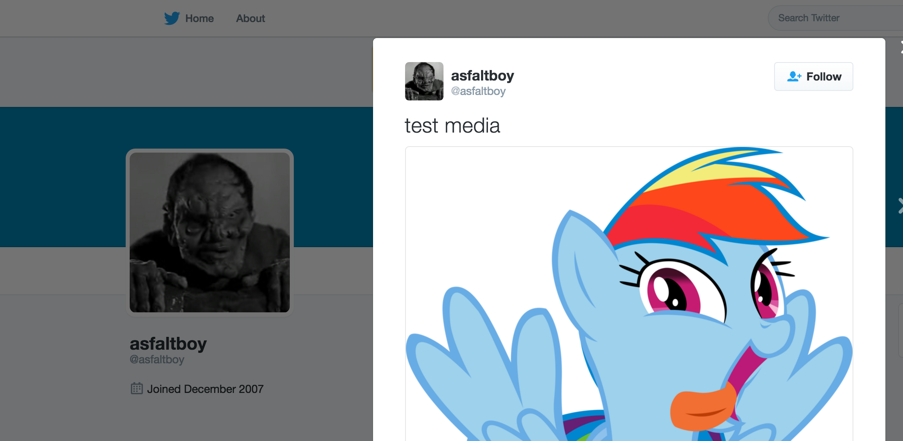

What Am I ?
===========

A simple Django project to demonstrate uploading and tweeting an image stored in S3 using django-storages.

.. code-block:: bash

    mkvirtualenv temp-so-38134984
    pip install -r reqs.txt
    django-admin startproject so38134984
    cd so38134984/
    python manage.py startapp tweet
    echo "from settings import *" > so38134984/host_settings.py
    export DJANGO_SETTINGS_MODULE=so38134984.host_settings

    # ... add our AWS / Twitter credentials to host_settings ...

    python manage.py migrate
    py.test

The result
----------

A tweet with the image that was uploaded to S3 now appears on my twitter, yay!

And the tweet in all it's glory: https://twitter.com/asfaltboy/status/750056136041168901
